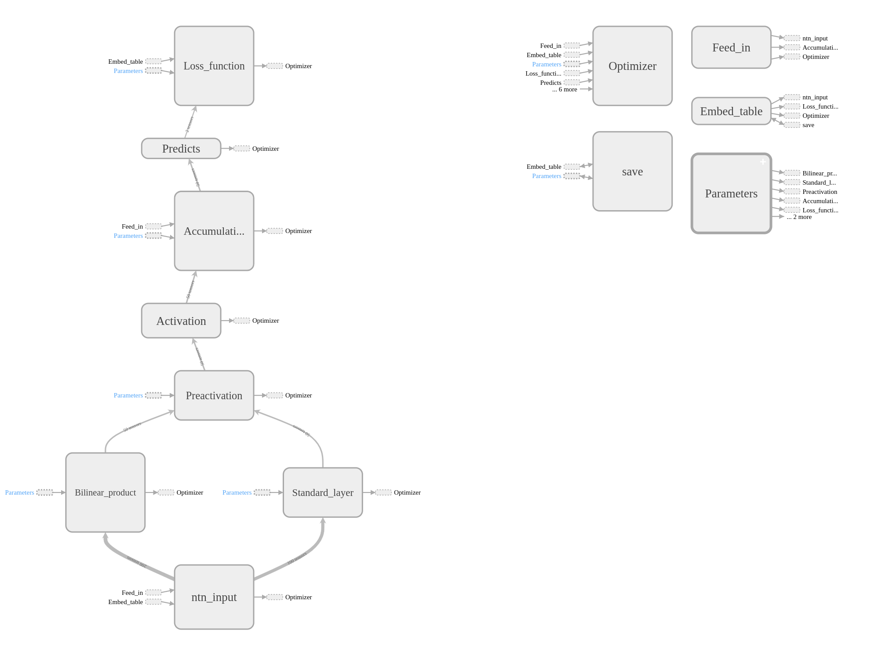

### Database Form
A database should contain three files:<br>
data.txt: each row is a triple. e.g. `Disease_or_Syndrome Affects Plant`<br> 
entities.txt: each row is a entity name. e.g. `Plant`<br>
relations.txt: each row is a relation name. e.g. `Affects`<br>

See the data directory.

### Database Class
Class is `core.knowledge_graph.KnowledgeGraph`<br>
Usage example<br>
```python
from core.knowledge_graph import KnowledgeGraph
database = KnowledgeGraph()
database.read_data_from_txt('data/kin')
```

### Neural Tensor Network (roughly done)
(For now) Run script `./train_ntn`<br>
Change hyperparameters directly in script.
#####Visualization from TensorFlow


### Cross validation script<br>(Will be deleted after merging training routine)
Usage example: `./cross_validation_srl.py kin.db -f 10 -a rescal -r 100`